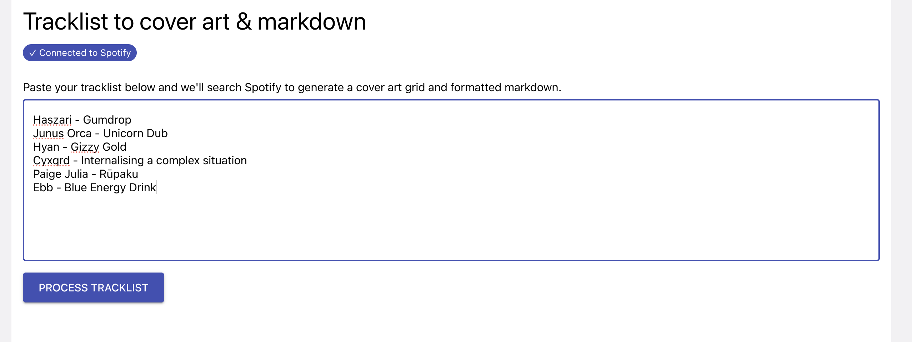
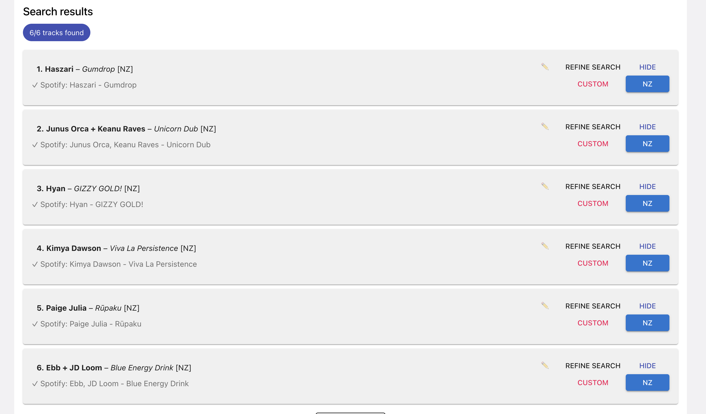
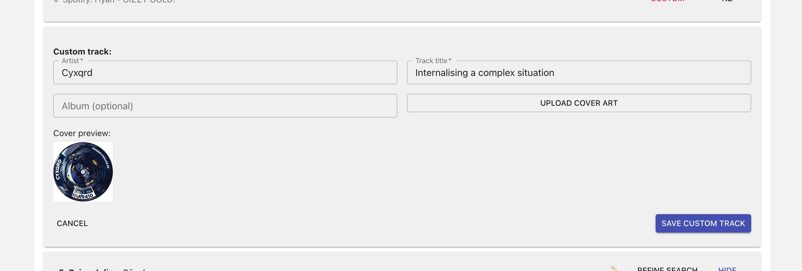
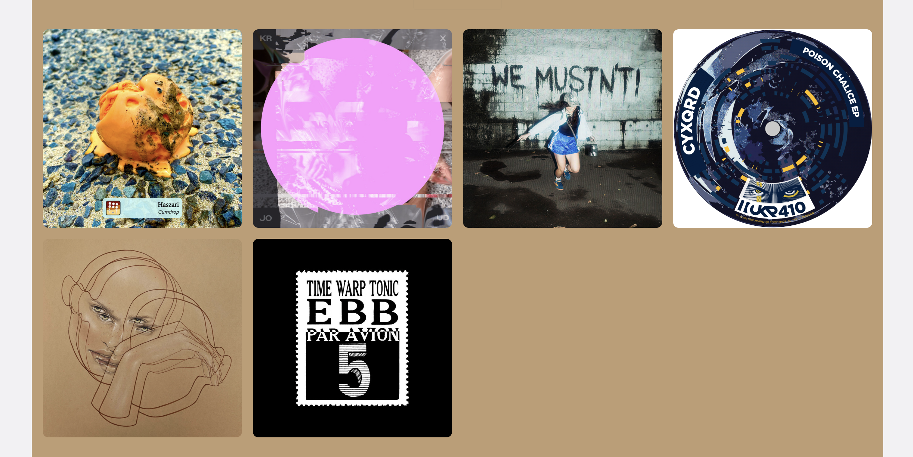
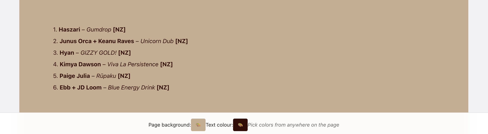
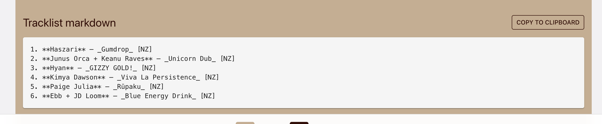

# Ajugi - playlist wrangling & music metadata tools

A tool for managing playlists for radio shows. 

## How to use

- Go to: https://lab.cartoonbeats.com/ajugi/
- Log in / authenticate Spotify. 
  - Your Spotify account is used to retrieve cover art images and search for music.
- Paste a tracklist into the text box.
- Click `Process tracklist`.

When it's finished processing you can customise each track in the playlist:

- Refine search to get the version, or fix a bad search result (i.e. there is a popular song squatting the top search result).
- Delete / remove / hide tracks.
- Add custom tracks with artist, title and uploaded cover art. E.g. unreleased or Bandcamp-only music, etc, anything not on Spotify.

Then you can tweak the generated assets:

- Edit the markdown used for the song in the list, e.g. to customise spelling or capitalisation.
- Check a box to note that a song is an NZ artist.
- Customize the colours of the rendered tracklist (requires Chrome for colour picker).

And finally use the assets:

- Screenshot the covers collage and tracklist image.
- Copy and paste the markdown tracklist.

## Screenshots

## Development

- `npm start` – run in dev mode
- `npm run build` - production minified build into `build` folder
- `npm run deploy` - production build and deploy to [GitHub Pages](https://pages.github.com)

---

Live on [GitHub Pages](https://pages.github.com): https://lab.cartoonbeats.com/ajugi/

## How to use

Currently this allows you to view a playlist as album art, and play specific albums. Kinda like browsing records in a record store and then listening to them.

1. Visit root url and authorise Spotify.
1. Click on a playlist to select it.
1. Click `Show Albums`.
1. Playlist will load - large playlists (1000+) take time.
1. View album cover art in a grid.
1. Click an album to show date, artist and title.
1. Click `Play` to play that album in Spotify.

Playback is controlled via Spotify, so you can skip, shuffle, etc as normal.

## Development

- `npm start` – run in dev mode
- `npm run build` - production minified build into `build` folder
- `npm run deploy` - production build and deploy to [GitHub Pages](https://pages.github.com)

---

This project was bootstrapped with [Create React App](https://github.com/facebook/create-react-app).
