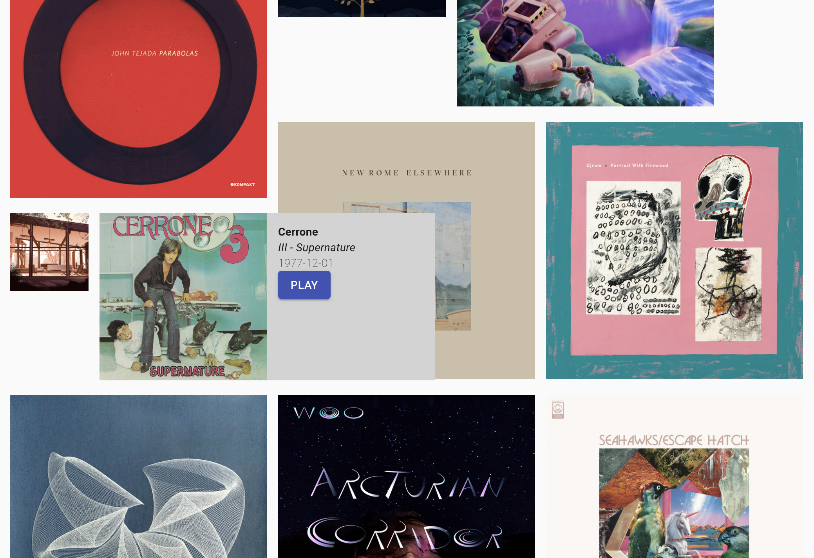

# Ajugi - Spotify playlist explorer

Experimenting with different ways of visualising Spotify playlists - e.g. by artist or album.

Live on [GitHub Pages](https://pages.github.com): https://landscape.cartoonbeats.com/ajugi/

## How to use

(tbc)

## Development

- `npm start` – run in dev mode
- `npm run build` - production minified build into `build` folder
- `npm run deploy` - production build and deploy to [GitHub Pages](https://pages.github.com)

---

This project was bootstrapped with [Create React App](https://github.com/facebook/create-react-app).
